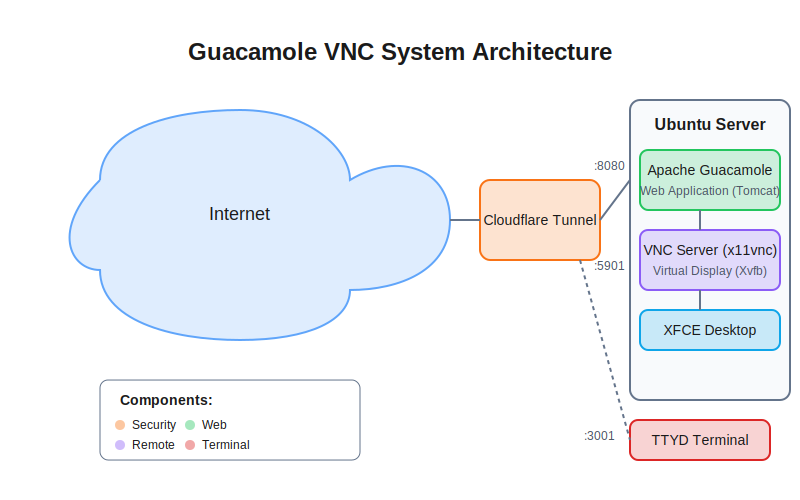

# Guacamole Cloudflare Tunnel

A comprehensive solution for secure remote desktop and terminal access using Apache Guacamole, VNC, and TTYD, tunneled through Cloudflare. This setup provides both GUI and terminal access through a web browser, secured by Cloudflare's tunnel service.

This project provides a complete setup for accessing Ubuntu desktop and terminal through a web browser, using:
- Guacamole for VNC-based desktop access (gui.yourdomain.com)
- TTYD for web-based terminal (dev.yourdomain.com)

Both secured and tunneled through Cloudflare, requiring no open ports.

[](https://github.com/prakash-aryan/guacamole-cloudflare-tunnel/blob/main/LICENSE)

## System Architecture


## Table of Contents
- [Overview](#overview)
- [Features](#features)
- [Prerequisites](#prerequisites)
- [Installation](#installation)
  - [1. Clone Repository](#1-clone-repository)
  - [2. Domain Configuration](#2-domain-configuration)
  - [3. Cloudflare Setup](#3-cloudflare-setup)
  - [4. System Components](#4-system-components)
  - [5. Service Configuration](#5-service-configuration)
- [Configuration Files](#configuration-files)
- [Security](#security)
- [Troubleshooting](#troubleshooting)
- [Contributing](#contributing)
- [License](#license)

## Overview

This project provides a complete setup for remote system access through:
- Web-based GUI using Apache Guacamole and VNC
- Web-based terminal using TTYD
- Secure tunneling through Cloudflare
- No port exposure to the internet

## Features

### Key Components
- **Apache Guacamole**: Web-based remote desktop gateway
- **VNC Server (x11vnc)**: Remote desktop access
- **TTYD**: Web terminal access
- **Cloudflare Tunnel**: Secure connection tunneling
- **XFCE Desktop**: Lightweight desktop environment

### Benefits
- 🔒 Secure access without exposed ports
- 🌐 Browser-based access (no client software needed)
- 📱 Mobile device compatible
- 🔑 Separate authentication for GUI and terminal
- 🚀 Fast and reliable connection through Cloudflare's network
- 👥 Multi-user support

## Prerequisites

- Ubuntu Server (20.04 LTS or newer)
- A domain name with Cloudflare DNS
- Cloudflare account with access to create tunnels
- Root or sudo access on the server
- Git installed
- At least 2GB RAM and 20GB storage
- Basic understanding of Linux systems and networking

## Installation

### 1. Clone Repository
```bash
git clone git@github.com:prakash-aryan/guacamole-cloudflare-tunnel.git
cd guacamole-cloudflare-tunnel
```

### 2. Domain Configuration
1. Register a domain if you don't have one
2. Add domain to Cloudflare
3. Ensure Cloudflare DNS is active

### 3. Cloudflare Setup

#### Install Cloudflared
```bash
# Download latest cloudflared
curl -L https://github.com/cloudflare/cloudflared/releases/latest/download/cloudflared-linux-amd64.deb -o cloudflared.deb

# Install package
sudo dpkg -i cloudflared.deb
```

#### Configure Tunnel
```bash
# Login to Cloudflare
cloudflared login

# Create tunnel
cloudflared tunnel create remote-access

# Copy tunnel credentials
sudo mkdir -p /etc/cloudflared
sudo cp ~/.cloudflared/*.json /etc/cloudflared/

# Copy config file
sudo cp config/cloudflared/config.yml /etc/cloudflared/

# Configure DNS
cloudflared tunnel route dns <tunnel-id> gui.yourdomain.com
cloudflared tunnel route dns <tunnel-id> dev.yourdomain.com
```

### 4. System Components

#### Install Required Packages
```bash
sudo apt update
sudo apt install -y \
    tomcat9 \
    xvfb \
    x11vnc \
    xfce4 \
    build-essential \
    libcairo2-dev \
    libjpeg-turbo8-dev \
    libpng-dev \
    libtool-bin \
    libossp-uuid-dev \
    libavcodec-dev \
    libavformat-dev \
    libavutil-dev \
    libswscale-dev \
    freerdp2-dev \
    libpango1.0-dev \
    libssh2-1-dev \
    libtelnet-dev \
    libvncserver-dev \
    libwebsockets-dev \
    libpulse-dev \
    libssl-dev \
    libvorbis-dev \
    libwebp-dev \
    ttyd
```

#### Install Guacamole Server
```bash
wget https://downloads.apache.org/guacamole/1.5.3/source/guacamole-server-1.5.3.tar.gz
tar xzf guacamole-server-1.5.3.tar.gz
cd guacamole-server-1.5.3

./configure --with-init-dir=/etc/init.d
make
sudo make install
sudo ldconfig
```

### 5. Service Configuration

#### Configure VNC
```bash
# Create VNC directory
mkdir -p ~/.vnc

# Set VNC password
x11vnc -storepasswd $USER/.vnc/passwd
```

#### Setup Services
```bash
# Copy service files
sudo cp config/systemd/* /etc/systemd/system/

# Start services
sudo systemctl daemon-reload
sudo systemctl enable --now xvfb
sudo systemctl enable --now x11vnc
sudo systemctl enable --now ttyd
sudo systemctl enable --now cloudflared
```

## Usage

After installation, you can access:
- Desktop interface: https://gui.yourdomain.com
- Terminal interface: https://dev.yourdomain.com

Default credentials:
- GUI (Guacamole): Set in user-mapping.xml
- Terminal (TTYD): Set in ttyd.service

## Configuration Files

### Directory Structure
```
.
├── config/
│   ├── cloudflared/
│   │   └── config.yml
│   ├── guacamole/
│   │   ├── guacamole.properties
│   │   └── user-mapping.xml
│   └── systemd/
│       ├── cloudflared.service
│       ├── ttyd.service
│       ├── x11vnc.service
│       └── xvfb.service
├── html/
│   ├── guacamole.html
│   └── index.html
├── vnc/
│   ├── xstartup
│   └── x-startup.sh
└── sys.svg
```

## Security

### Best Practices
1. Use strong passwords
2. Regularly update system packages
3. Monitor access logs
4. Back up configurations
5. Consider implementing 2FA
6. Keep Cloudflare security settings strict

### Access Logs
Monitor service logs:
```bash
sudo journalctl -u x11vnc
sudo journalctl -u cloudflared
sudo journalctl -u ttyd
```

## Troubleshooting

### Common Issues

1. **VNC Connection Failed**
   ```bash
   # Check service status
   sudo systemctl status x11vnc
   # Verify display
   echo $DISPLAY
   ```

2. **Cloudflare Tunnel Issues**
   ```bash
   # Check tunnel status
   cloudflared tunnel list
   # Check logs
   sudo journalctl -u cloudflared
   ```

3. **TTYD Access Problems**
   ```bash
   # Verify service
   sudo systemctl status ttyd
   # Check port
   ss -tulpn | grep 3001
   ```

## Contributing

1. Fork the repository
2. Create your feature branch (`git checkout -b feature/AmazingFeature`)
3. Commit your changes (`git commit -m 'Add some AmazingFeature'`)
4. Push to the branch (`git push origin feature/AmazingFeature`)
5. Open a Pull Request

## License

This project is licensed under the MIT License - see the [LICENSE](LICENSE) file for details.

## Repository

```
git@github.com:prakash-aryan/guacamole-cloudflare-tunnel.git
```
